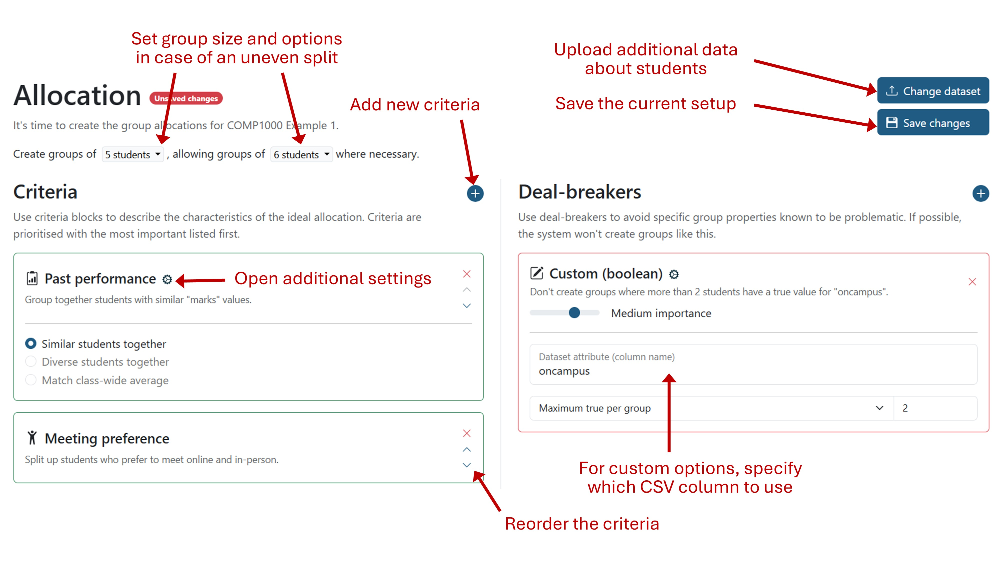

# Team allocation

This guide explains how to use the tool to allocate students to teams
automatically. Before getting started, you'll need to make sure you've done the
following:

* Added all of the students on the [Students page](./StudentsPage.md) and set
any pairing exclusions for students who can't work together.
* Configured the required skills on the Configure page, then run the skills
questionnaire and given students a chance to answer it.
* Asked students to set a meeting preference in their profile, if they have one.
* Gathered any data that you plan to use during allocation into a CSV file. This
guide will describe how to format it later.

When you're ready, you can then go to the Overview page for the assignment and
click the "Close questionnaire" button to enter the allocation stage.

## How allocation works

You specify detailed requirements to describe the teams you want to create, and
the system will attempt to find the allocation of teams that best matches them.
The system is highly configurable and includes advanced features to allow you to
use custom data.

The core idea is that you specify "criteria" and "deal-breakers" to describe
your requirements:

* **Criteria** define the "ideal" characteristics of teams for your assignment.
For example, that each team has a range of skillsets and similar previous marks.
They are ordered by importance.
* **Deal-breakers** define specific characteristics to avoid. These are binary,
so are either triggered for a team or not. They might include avoiding teams
with a lone female/non-binary student or where they match teams from another
assignment. You can set the importance of each deal-breaker individually.

A good way to think about this is to imagine you're manually allocating teams
with a spreadsheet. The characteristics you'd look for when initially grouping
students together would be your criteria. The problems you'd look for afterwards
and then fix would be your deal-breakers.

## Configuring allocation

> [!WARNING]
> If there are multiple lecturers on an assignment, only one should configure
> and run allocation. Otherwise, you might accidentally edit the settings while
> someone else is generating allocations.

Head to the "Allocation" page to get started. If you don't see it, check that
the assignment is in the third stage on its Overview page.

1. Start by choosing your desired group size. You should also choose whether to
make larger or smaller groups, in case the class won't split evenly.
2. Choose and configure the criteria you'd like to use. Use the plus button by
the "Criteria" header to select a new one from the list, then reorder them using
the arrows on the boxes. Some criteria have additional options which can be
viewed by clicking the gear icon by their name.
3. Choose and configure any deal-breakers you'd like to use. You don't need to
set any if you don't want to. Similarly to the criteria, choose any you'd like
to add from the popup. You don't need to reorder them as you can set their
importance levels individually.
   - If you just want to see which teams would trigger a deal-breaker but
   without avoiding them, set the importance to "Just tell me".
4. If you've selected any options that require additional data, click "Upload
dataset" to upload it as a CSV. You can download a template and the popup will
show you which data it needs.
5. Remember to save your changes regularly by clicking "Save changes".

## Reviewing generated allocations

Once you've configured the criteria and deal-breakers to use, and uploaded any
additional data, you can save your changes and click "Start allocation". If you
have a large class, it may take up to a minute to generate the teams.

The popup will reload to show you the best allocation it could find. It lists
each team, along with how well they meet the criteria you defined. The worst
matching teams are shown first, with the overall quality of the allocation shown
at the top.

If the best allocation requires triggering a deal-breaker for a team, it will
flag this up at the top. You can always go back and increase that deal-breaker's
importance to prevent this if you need to.

You can inspect the data that the system used during allocation using the data
spotlight. Simply choose an attribute from the dropdown on the left to see each
student's data point.

You can also store allocations in case you want to keep generating them, or if
you want to edit the settings. Just click the "Store current allocation" button
and it will be added to your stored list. You can choose a stored allocation
from the dropdown to view it again.

When you're happy with the teams, click the green "Confirm" button. You can get
the system to automatically email students to notify them if you wish. If you
want to choose a stored allocation, simply select it from the dropdown and then
click "Confirm".

## Available options

This section outlines the various criteria and deal-breakers that are available
for you to choose.

> [!TIP]
> If you need to randomise team allocation, you should select only the meeting
> preference criteria. This will generate random allocations that still obey
> students' preferences.

### Criteria

* **Skill coverage**: uses the data from the skills questionnaire to create
teams where someone is confident in every skill. Works best when most students
completed the questionnaire.
* **Past performance**: include a `marks` column in the CSV to allocate teams
where the average mark matches the class average, where the marks are similar or
where they're as varied as possible.
* **Degree programme**: include a `degree` column to allocate teams where
students are on the same degree programme or where they're different.
* **Enrolment**: include an `enrolled` column to allocate teams where the
proportion of unenrolled students matches that of the class. You can also
explicitly group together or separate enrolled/unenrolled students.
* **International**: similarly, you can include an `international` column and
use the same options.
* **Meeting preference**: where students have expressed a meeting preference in
their profile, aim to create where everyone has compatible preferences.

### Deal-breakers

* **Lone gender**: include a `gender` column in the CSV to avoid teams with
exactly one male, female or non-binary student.
* **Lone female/non-binary**: include a `gender` column to avoid teams with
one female or non-binary student. Teams with one male students are allowed.
* **All international students**: include an `international` column to avoid
teams where everyone is an international student.
* **Assignment crossover**: when the system is being used for multiple group
project simultaneously, this option will stop students being placed in teams
with team-mates from the other projects.

### Custom options

You can also define custom criteria and deal-breakers, using your own data from
the CSV. You'll need to choose whether the data is textual, numeric or boolean.
More information can be found in the [technical guide for allocation](../../technical/AllocationAlgorithm.md).
