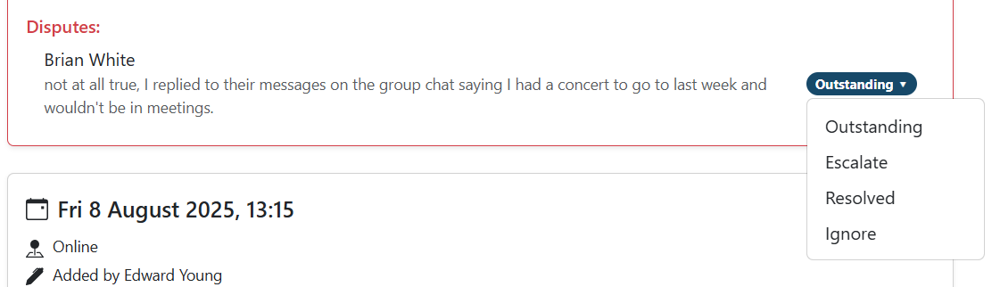

# Meeting disputes

As teams record meeting minutes themselves, there may occasionally be
disagreements about their accuracy. Mistakes could be accidental (such as
mistakenly marking someone as absent) or deliberate.

If a student disagrees with the record for a specific meeting, they can submit a
dispute about it. They will be encouraged to first speak to the minute taker to
clarify any mistakes and to summarise this discussion in their dispute comment.

## Dispute states

A dispute is tied to a specific meeting record and can be in one of four states:

* **Outstanding**: this is the default state, meaning the dispute has yet to be
reviewed by staff/supervisors.
* **Ignore**: the dispute can be ignored without any action.
* **Resolved**: action has been taken to resolve the dispute (e.g. editing
meeting minutes).
* **Escalate**: the person who reviewed the dispute isn't sure what to do, or
further investigation is needed.

## Viewing disputes

If any teams have an outstanding meeting dispute, this will be flagged on the
Teams page as a "severe" level insight. An example is shown below.

You should then click the team's menu (⋮) and choose the "Meetings" page. Here
you can scroll down to the relevant meeting, which will be outlined in red with
the word "Disputed" by the date and time.

The dispute comment will be shown at the bottom of the meeting record. Take any
action you need to and then change the state of the dispute by clicking the
dropdown marked "Outstanding" on the right.

## Recording actions you've taken

Disputes won't show up in progress reports, so you should make an observation
note detailing the dispute and any action you have taken to resolve it.

Note that if you delete a meeting, any linked disputes will be deleted too. In
this case, an observation will be automatically recorded but you are encouraged
to delete it and add a manual observation with more context.
