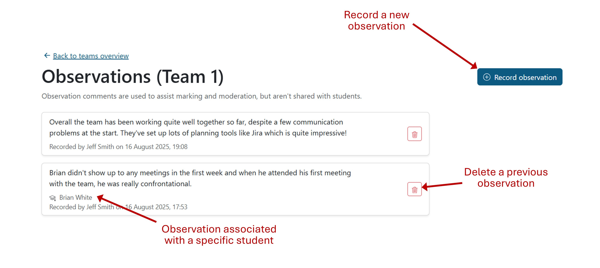

# Observations

This guide explains how team and student observations work within the app.

These are short notes about teams or individual students within a team that can
be recorded by module staff or supervisors. They should be used to explain any
problems the team faced (e.g. a team member off sick), highlight examples of
good work or simply make a note to be read during marking.

The Observations page can be accessed via the [Teams page](./TeamsPage.md).
Click the ⋮ menu button for a team and choose the Observations option. Here you
can see all of the existing observations that have been recorded about the team,
with the most recent listed first.

> [!NOTE]
> Observations appear in [progress reports](./Reports.md). If you link one to a
> specific student, it will appear under their name.

## Recording a new observation

Click the "Record observation" button to open the popop. Enter a short comment
explaining the situation. If it relates to the whole team, you can leave the
students box blank. If it's about a specific team member (or members), choose
their names in the dropdown box.

Remember to click Submit to save your changes.
