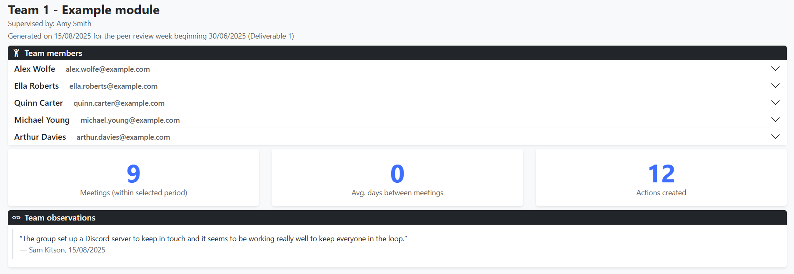

# Reports

This guide explains how to generate and interpret the progress reports that
staff and supervisors can download about teams.

Reports aggregate data about each team (and the students within them) to produce
downloadable documents that can provide evidence for marking decisions. The
following data is included where available:

* Team number and supervisor names.
* Team-wide observations made by staff or supervisors.
* Meeting statistics for the team.
* For each team member:
  * Name and email address.
  * Meeting attendance and action statistics.
  * Measures of engagement with the system.
  * Workload balance, both self- and peer-perceived.
  * Skill ratings from peers (for a specific full check-in).
  * Peer review comments (for a specific full check-in).
  * Observations made by staff or supervisors.
  
## Report formats

Reports are generated as HTML documents that can be downloaded and viewed 
without logging into the system. This allows them to be shared with people who
don't normally have access (such as moderators). However, this naturally comes
with security risks so take care to securely store any downloaded reports.

To view a report, simply open it in a web browser (preferably Chrome). You'll
need an internet connection to load the formatting. To view offline or to print
a report, just print using your browser (or press CTRL+P or CMD+P). You can also
save it as a PDF using this method.

## Generating reports

Reports can be generated from the "Reports" page in the sidebar, where you have
a number of options to choose from:

* **Select teams**: generate a report for a specific team or in bulk for every
team.
* **Peer review point**: if teams have completed a full peer review, you can
select it here to include its skill ratings and review comments in the report.
* **Report start/end date**: all data is included by default, but you can set
these dates to limit the reports to a specific date range. It must include the
peer review week (if selected).

If you have selected a specific team, you can preview the report in the browser.

## Example reports

Shown below are some screenshots of example reports.

