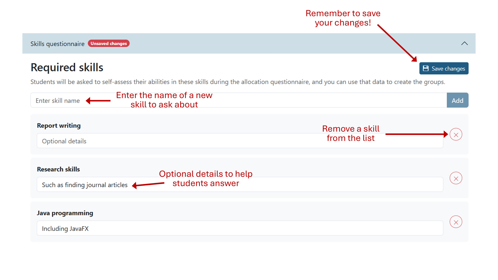

# Skills questionnaire

The system can help you gather information about students' confidence levels in
various skills that are important for the assignment. You can then use this data
during allocation to create teams with a balance of skillsets. Students can also
see their team-mates' top-rated skills, helping them to assign tasks more
effectively.

## Configuring the questionnaire

You should set this up at the very start of the assignment, while it's in the 
"Getting ready" stage. Head to the "Configure" page for your assignment and
open the "Skills questionnaire" tab. 

Here you can add the skills that are important for the assignment. These can be
soft skills (such as communication or leadership) or technical skills important
for success in the coursework.

Simply type the name of a skill in the text box, then click "Add". You can also
add extra details in the list below. For example, if you add "research skills",
you could use this space to clarify that you mean finding library books and
journal articles. Students will see these optional details on the questionnaire.

Remember to save your changes!

> [!TIP]
> As a rough guide, around 3 to 6 skills tend to work well.

## Releasing the questionnaire

Once you've added your students and set up the skills, you can release it to
students. Just click the "Open questionnaire" button on the assignment's
overview page. Students will then be able to log into the system and fill in the
questionnaire.

You can see how many students have answered it by looking at the assignment's
overview page. You can also send reminder emails to students by clicking the
"Send reminders" button.

Once students have started to answer it, you'll be able to see a class summary
as a chart on the overview page.

## Skipping the questionnaire

Although it's recommended that you use the skills questionnaire, you can skip it
entirely. Just remove any skills you've added using the Configure page and then
click "Skip questionnaire" on the overview page.
