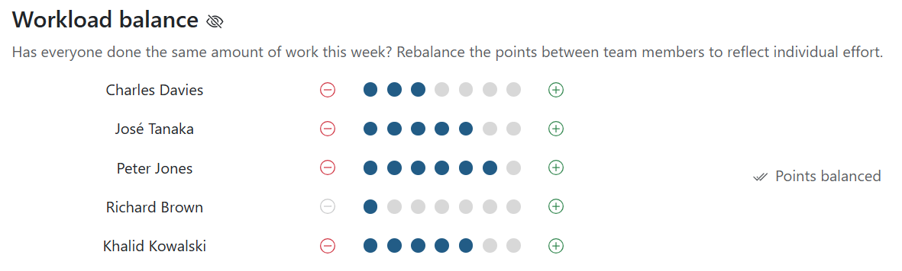
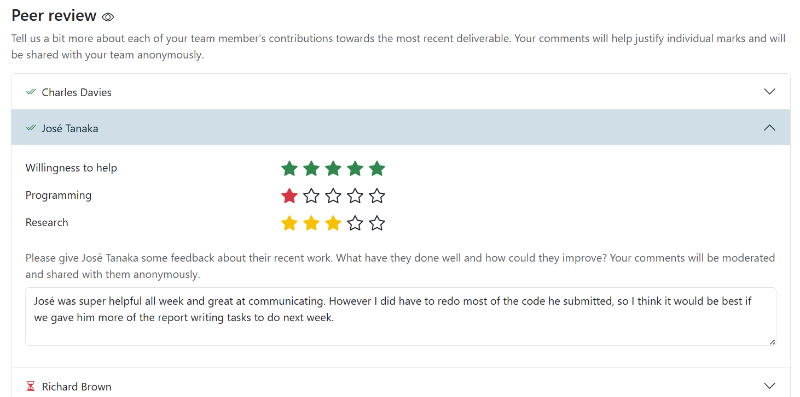

# Check-ins and peer reviews

This guide for students explains how the check-in and peer review feature works.

A recurring problem with regular group coursework is that different team members
put in different amounts of effort, and the workload isn't balanced. To make it
worse, it's hard to track this and keep evidence of it in case you need to raise
the problem with your lecturers.

This app includes a feature called "check-ins" to help fix this. Every week, you
tell us how balanced the workload has been in your team that week. It only takes
a minute to fill in, and gives your supervisor and lecturers valuable insights.

## Check-ins

You can complete your weekly check-in by going to the Check-In page for your
assignment.

You'll see a list of your team members, each with a number of dots beside their
name; these reflect the relative amount of work completed. By default the points
are balanced and you should submit it like this if everyone has put in an equal
amount of effort.

If you believe someone has put in more effort than the others, use the plus
button to give them extra points. You will need to balance the points overall,
so think about whose work they did instead and remove the extra points from
them.

Similarly, if you think someone did less work you should remove some of their
points and add them to the team member (or members) who did that work instead.

> [!IMPORTANT]
> There are a fixed number of points, so you can't just remove someone's points
> without giving them to someone else.

## Peer reviews

If your lecturer has set this up, you might be asked to fill in some longer peer
reviews. These are valuable sources of information for your supervisor and
lecturers to know how each team member worked, so it's important you complete
them truthfully.

When you need to complete one, it will appear underneath the check-in question
for that week. For each team member you'll be asked to rate their ability in
some key skills and then leave a review comment for them. 

> [!NOTE]
> Check-in scores and skill ratings are only visible to staff and supervisors.
> Review comments will be moderated and, if your lecturer chooses to, may be
> sent to the students they're about as formative feedback. Be polite, helpful
> and constructive!

