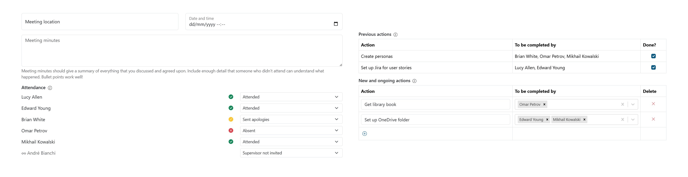
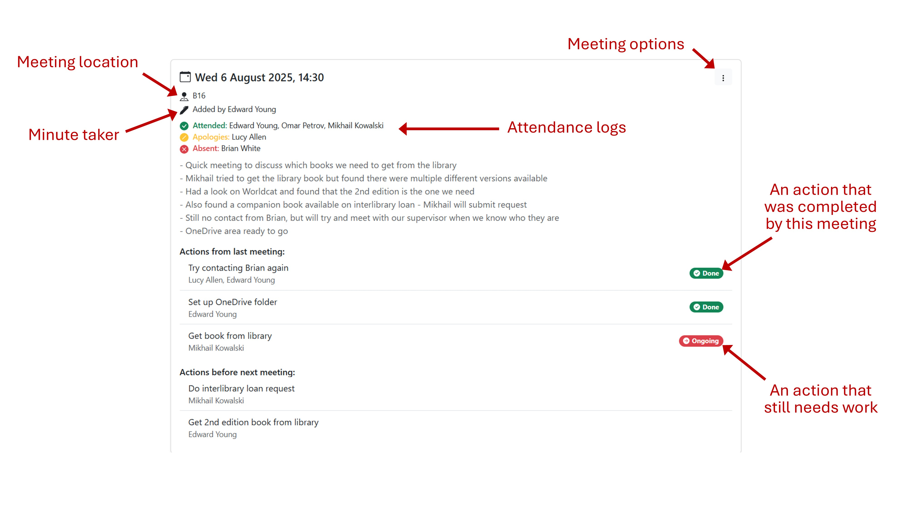

# Meetings

A key part of this system is the ability for you to record your team meetings in
one central place. Taking accurate records of your meetings comes with a number
of benefits:

* It's easier to track your progress and see how you're getting on.
* You have an accurate record of meeting attendance.
* Everyone can see them, so if someone regularly doesn't show up they can't
claim they didn't know what was happening!

The app has a simple meeting minutes template to help you.

## Recording meetings

Anyone in your team can record meeting minutes. It's easiest to do this during
the meeting or shortly afterwards. If you find it easier, you could handwrite
or type up the discussion notes separately and then copy them into the app.

To get started, head to the Meetings page in the sidebar and click "New
meeting". There are a number of fields to complete for each meeting:

* **Location**: where did the meeting take place? If it was a remote meeting,
just put "Online".
* **Date and time**: enter the date and time that the meeting started.
* **Meeting minutes**: this is where you type up notes about what was discussed
during the meeting. You don't need to record everything word-for-word, but you
should make a note of any key decisions. Include enough detail so that someone
who missed it can catch up quickly.
* **Attendance**: make a note of who showed up. There are a few options:
  * Attended: they were present in the meeting.
  * Sent apologies: they told the team ahead of time that they would be unable
  to attend.
  * Absent: they were expected but didn't turn up.
* **Previous actions**: reflect on the goals that you set in the previous
meeting. Tick off whether they were completed or not.
* **New actions**: agree on some key goals to complete before the next meeting.
You can assign one or more team members to each. In the next meeting, these will
appear in the "Previous actions" table.

When you're ready, hit "Submit". Everyone will be able to see the meeting on
their device.

## Viewing meeting history

You can see all of the previous meeting for your team on the Meetings page. The
most recent meetings are shown first, with the overall attendance summary shown
on the right hand side.

## Editing or deleting meetings

For up to an hour after you submit meeting minutes, you can go back and edit
them. Click the ⋮ menu for the meeting you want to edit and choose "Edit". Make
any changes that you need to and then click "Submit" to save them.

You can also delete a meeting you recorded for up to an hour afterwards.

Only the person who originally recorded the meeting can edit or delete it. Your
supervisor or lecturer can always edit or delete meetings, so ask them if you've
made a mistake and it's been longer than an hour.

> [!WARNING]
> Whenever you or someone else edits a meeting, an audit log will be kept. You
> can see this by selecting "Edit log" under the ⋮ menu for an edited meeting.

## If you disagree with a meeting record

You might sometimes disagree with what's been recorded in the meeting minutes or
attendance log. Usually this will have just been a mistake, so please talk to
the person who recorded it first (you can see their name by the pen icon). If
it's less than an hour after they posted it, they can go back and correct it for
you.

If you still disagree or it's been longer than an hour, you can log a dispute
against the meeting. Click the ⋮ menu and choose "Dispute". In the popup, you'll
need to explain the problem and summarise the discussion you had with the person
who recorded the meeting.

Your supervisor or lecturers will be able to see that you've logged a dispute,
and take action to fix the problem (such as editing the meeting). It will appear
on their dashboard but they won't be notified automatically, so it might be
worth emailing them to ask them to look at your dispute.
