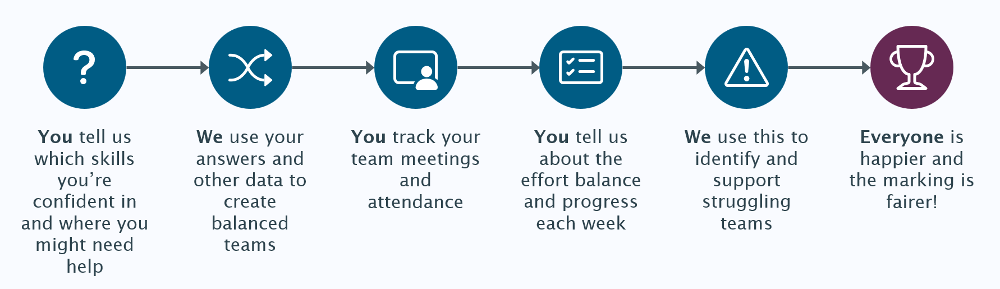

# Student quick start guide

This is a short guide to get you started with the group coursework system as a
student. Not every feature will be covered, so you should check the other
guides for help with more advanced features.

## What does this app do?

In short, it's designed to make group coursework fairer, easier and more
enjoyable for everyone involved - staff and students! It does this with 4 key
features:

This app will become a central place for monitoring and recording your team's
progress throughout the coursework. By keeping everything in one place, staff
and team supervisors can identify people who might be struggling and offer
support. It can also generate reports to help staff decide marks fairly based
on individual contributions throughout. The diagram below shows how it'll be
used:

## Getting started

To get started, simply head to the app and click the blue login button. This
will link your University account and you'll be logged in.

Once your lecturers have got everything set up, you'll see your group coursework
project on the dashboard and in the sidebar. Click this to select it.

## Skills questionnaire

You might be asked to fill in a skills questionnaire. This only takes a minute
and you just need to say how confident you are in some key skills.

Lecturers can use this to help create teams with a range of skillsets. Your
top-rated skill will also be shown to your team, so you get given tasks that
suit you better.

> [!IMPORTANT]
> It's important to answer honestly, otherwise you may be placed in a team
> that's missing key skills. Your responses will be visible to staff alongside
> your historic marks.

[Learn more](./SkillsQuestionnaire.md) about the skills questionnaire.

## See your team

Once allocated, you'll be able to see your team under the "My Team" tab. You'll
be able to see everyone's top-rated skill, meeting preferences and email
addresses. If you have a team supervisor, they'll show up here too.

> [!TIP]
> You can set your own meeting preference and bio on the "Profile" page.

[Learn more](./TeamDetails.md) about the team details page.

## Record meetings

Taking accurate meeting minutes is an important skill to learn. To help you,
you'll record all your meetings in the system. It helps you keep track of
attendance, discussions and any actions agreed. Meeting minutes are visible to
your whole team and the module staff. This means if anyone misses a meeting,
they can easily catch up. Head to the "Meetings" page to get started.

[Learn more](./Meetings.md) about recording your meetings.

## Complete check-ins

Every week, you'll tell us how balanced the workload has been that week. It only
takes a minute to answer the question and show if anyone did more or less work
than others.

Each week is a fresh start, so don't worry if you're off sick for one - staff
will be able to see how the balance has been over the entire coursework.
Everyone's scores from the team are combined together so it's really important
to fill in your check-ins and have your say.

[Learn more](./CheckIns.md) about check-ins and peer reviews.

## Longer peer reviews

If your lecturer has configured this, you might be asked to fill in a few longer
peer reviews. Some weeks you might be asked to complete one at the same time as
your regular check-in. It's your chance to rate each team member's ability in
the key skills and leave them a review comment to tell them what they've done
well, and how to improve.

> [!NOTE]
> Check-in scores and skill ratings are only visible to staff and supervisors.
> Review comments will be moderated and, if your lecturer chooses to, may be
> sent to the students they're about as formative feedback. Be polite, helpful
> and constructive!

## Learn more

That's it for this quick introduction guide, but there's lots more to find out.
Explore some of the other guides in this section to get the most out of the app.
