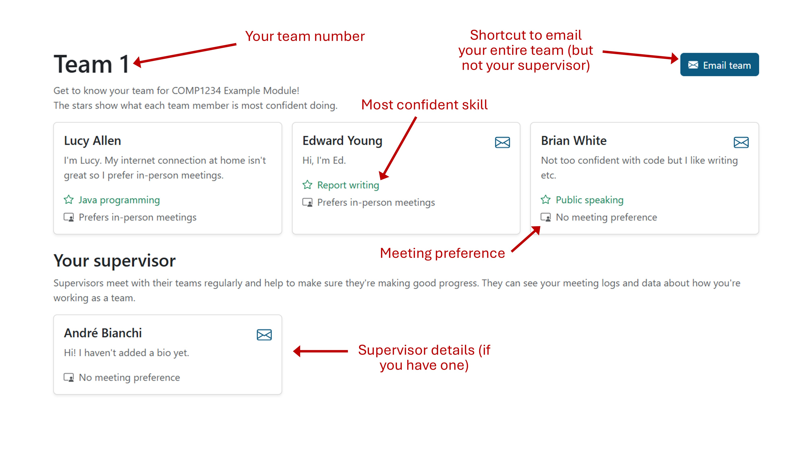

# Team details page

Once teams have been allocated, you'll be able to log in and see who else is in
your team. Just select the assignment and then go to the "My Team" page in the
sidebar.

This page shows details for each of your team members, including:

* Their email address.
* The skill they're most confident in.
* Their preference for meetings.
* Their bio, if they've added one.

You can also email your whole team.

## Supervisor details

If this has been set up for your assignment, you might have a team supervisor.
You'll be able to see their details here and contact them by email. They have
full access to your meeting minutes, check-in responses and peer reviews.

